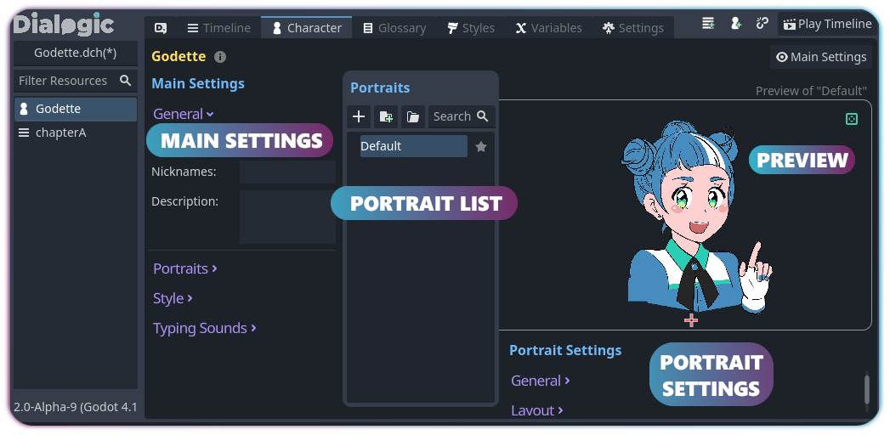

     
Character & Portraits

*The character editor allows you to edit character resources (`.dch`). It has four sections.*

## 📜 Content
[toc]

## 1. Main Settings

The character resource has a number of settings:

#### 1.1 General

- **Display Name:**
  *This string will be shown on the name label.*

- **Nicknames:**
  *These strings (comma separated) will also be considered for the `Autocolor names` option.*

- **Description:**
  *Does nothing. Could help you remember what this character was for.*

#### 1.2 Portraits

- **Default Portrait:**
  *The portrait that will be used if none is specified (for Character event `Join` mode or text effect [portrait]). This does not affect Text events without a portrait specified! In that case, there will be no change.*

- **Portrait Settings:**
  *Scale, offset and mirror settings that will be applied to all portraits. Note that scale, offset and mirror can also be set individually per portrait.*

#### 1.3 Style

- **Style:**
  *If you set a custom style, it will be used whenever this character is speaking. As this can result in rapid style changes, we suggest using the same layout for variations like this.*

#### 1.4 Typing Sounds

- **Sound Moods:**
  *A sound mood is a folder of sounds, and a random one is played for each letter these characters say. You can have different sound moods for different portraits.*

---

## 2. Portrait list

The portrait list allows you to add portraits to your character. A portrait is a scene that will be instanced and moved around by Dialogic when you use the Character event.

A character can have unlimited portraits, but each has to have a unique name.

1. Add a new portrait
2. Add a new portrait group
3. Import a folder of images as portraits
4. Rename a portrait or group *(or double-click or use F2)*
5. Duplicate a portrait
6. Delete a portrait or group *(or Delete key)*

*Note: Groups are not actually saved. Instead, a portrait gets the name "Group" or "Portrait". This means empty groups will get lost when leaving the editor.*

---

## 3. Preview

The preview shows the selected portrait (or nothing, if you don't have a portrait). You can switch between a `Full view` that will size the character so it's fully visible and a `Real size` view that shows the character at full scale.

---

## 4. Portrait settings

The portrait section consists of multiple sections, each containing settings for the currently selected portrait.

The most important setting is the scene a portrait uses. The default scene allows you to select an image. Learn more about how to create a custom portrait here: [Custom portraits](custom-portraits.md)

For any portrait, you can set a scale, offset and mirror setting. These are additive to the main scale, offset and mirror. You can choose to ignore the main character scale to work around this.

When you use a custom portrait, you can override its exported variables here.
