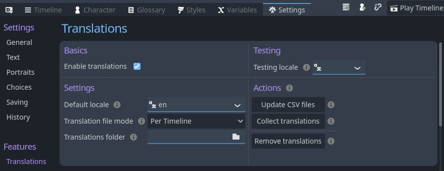

<div class="header-banner pineapple">
     <div class="header-label pineapple">Translations</div>
</div>

*This page explains how Dialogic allows you to translate timelines and other important parts of your dialogs.*

## 📜 Content
[toc]

## 1. What is a translation?

Translation is a Godot and Dialogic 2 feature, allowing you to translate your game into multiple languages.

Sometimes, the word *localisation* is used as well.
Localisation provides very specific regional considerations for each consumer market.\
This includes not only the translation of the game, but also changes to the game itself to reflect specific cultural differences.

While Dialogic supports the translation of your timeline, it's better to focus on
your game first and add translation later.\
However, keeping translation and localisation in mind is an excellent idea:

- How will you handle variables?
- Do you need the glossary?
- What images do you want to localise?
- Any features in mind that may complicate translation?

```admonish info
For now, Dialogic supports CSV translation only.
Godot itself supports `gettext` as well.
```

---

## 2. How do I translate timelines?

In Dialogic, head to the Settings tab, and take a look under the Translation section. Tick the "Enable Translation" checkbox.



### 2.1 Setting up translation

Let's walk through the settings! You will have to pick a default locale.
This locale must be the language you write the timeline in.
Additionally, this locale will be used as a fallback if no translation exists for a given translatable event.
The "translation file mode" allows you to store all your timelines into one file (Per Project) or into multiple files (Per Timeline).

Setting up a translation folder is a good idea; it keeps your project clean and allows you to easily find your translation files.

### 2.2 Writing translations

First of all, you will need a timeline file. Dialogic will automatically find and generate CSV files for you after you hit the "Update CSV files" button.

The CSV format is simple, and you can open it with any spreadsheet software, like Excel or Google Sheets. Even VSCode offers extensions to edit the file.\
The gist of CSV files is that each line represents a row, and each column is separated by a comma.

Once Dialogic has generated the CSV file, it may look like this:

```csv
keys,en
Text/1/text,Hello World!"
```

The `keys` are locales, the `en` is the locale code for English. If you choose a different default locale, the locale code will be different.

You can add a new language for your game by adding a new column. The following example added "ja" for Japanese to the first row and translated the text in the second row. Pay attention to the commas!

```csv
keys,en,ja
Text/1/text,Hello World!,こんにちは世界！
```

That's it! You can now hit "Collect translation," and Dialogic will generate a translation file for you.\
The translation file is a specific Godot file. Here is their official documentation: [Internationalising games](https://docs.godotengine.org/en/stable/tutorials/i18n/internationalizing_games.html)

```admonish
In CSV, you use commas to separate columns. However, if you want to use commas inside your text, you will have to wrap your text in quotation marks.
```

### 2.3 The Translation workflow

From now on, whenever you change the CSV file, you can hit "Collect translation" and Dialogic will update the translation files for you.\
Once you are done editing your timeline, you will have to hit "Update CSV files" to update the CSV file.

To verify whether your timeline has properly inserted your text into the CSV, you can switch to the timeline Text editor. Obviously, you can check the CSV file too.

```dtl
Character: Hello world! #id:14
Do you like Visual Novels? #id:15
- Yes, I do! #id:16
- No, I love them! #id:17
That's the spirit! #id:18
```

The `#id` tags at the end of each Text Event are the translation IDs. They won't be visible during text display; however,  Dialogic has inserted the text into a CSV file.

### 2.4 Testing translation

If everything went well, you can select a different locale in the "Testing locale" dropdown.\
Hit "Play Timeline" or "Run Project" and take a look at the translated text.\
This setting is editor-only and may not work in exported projects.

---

## 3. Changing the Language

The translation process is handled by Godot!

To change the locale when your game is exported, use the Godot API method on the [TranslationServer](https://docs.godotengine.org/en/stable/classes/class_translationserver.html#translationserver) class:

```gdscript
# Japanese's language code is "ja"
TranslationServer.set_locale("ja")
```
